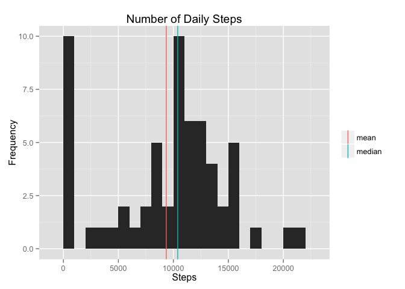
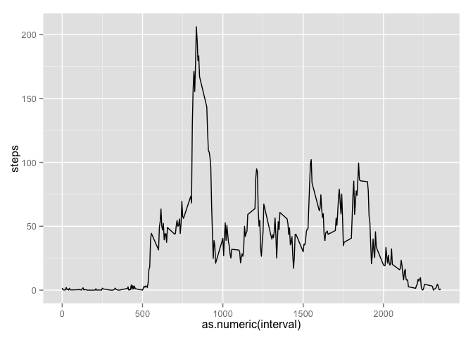
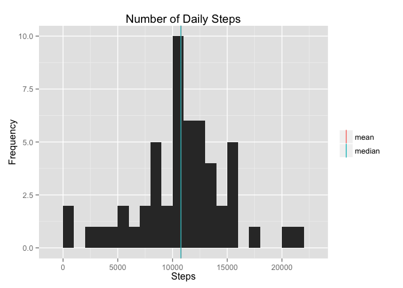
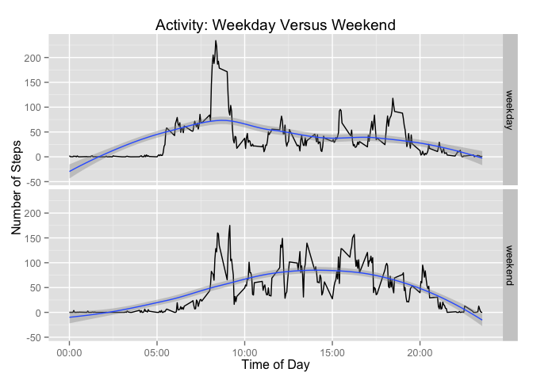

# Reproducible Research: Peer Assessment 1

## Environment Setup

There are three packages that will be used in this document, so begin by loading them up.


```r
library(dplyr)
```

```
## 
## Attaching package: 'dplyr'
## 
## The following object is masked from 'package:stats':
## 
##     filter
## 
## The following objects are masked from 'package:base':
## 
##     intersect, setdiff, setequal, union
```

```r
library(lubridate)
library(ggplot2)
```

## Loading and preprocessing the data

Read the data, which is from a CSV file.  Very little special
processing is required to read the data because it is in a
straightforward format. The only additional requirement needed when
reading the data is that dates stored in a text format are often
automatically assigned the "factor" type unless otherwise specified,
so the call to `read` specifies that the date field is a character
field to assist in further processing.

The interval field in the data is a text field describing the start of
the 5-minute interval the step count is measured in.  Interpreting the
field as an integer is not useful because it is really a clock time.
Therefore, we use `sprintf` to pad the field with leading zeros (so
that, for example, "10" becomes "0010").


```r
setwd("/Users/mgast/Dropbox/data-science-specialization/5-reproducible-research/RepData_PeerAssessment1")
activity <- read.csv("activity.csv",colClasses=c("integer","character","integer"))
activity$interval <- sprintf("%04d",activity$interval)
```

Creating accurate timestamps requires a bit of processing as well.
With the date field plus the interval field, we have both a date and
time of day.  `strptime` returns a time stamp, but in a complex POSIX
data structure that does not go into a data frame.  Therefore, we call
`strftime` on the output of `strptime` to create a simplified POSIX
data structure.

Finally, we add a field for the type of day, whether a weekday or a
weekend.  Because there are only two weekend days, it is much easier
to check that the day of the week is either the string "Saturday" or
"Sunday".


```r
activity <- mutate(activity,datetime=strftime(strptime(paste(date,interval), format="%Y-%m-%d %H%M")))
activity <- mutate(activity, day=weekdays(as.Date(activity$date)))
activity$daytype <- "weekday"
activity$daytype[activity$day %in% c("Saturday","Sunday")] <- "weekend"
```

## What is mean total number of steps taken per day?

1. Calculate the total number of steps taken per day

The `aggregate` function groups and summarizes data.  In this case, we
tell the function to group the step count by day and apply the `sum`
function.  Calling `aggregate` has the side effect of rewriting the
column names, so it is necessary to rewrite the column names.


```r
daily.steps <- aggregate(x=activity$steps, by=list(activity$date), FUN=sum, na.rm=TRUE)
names(daily.steps) <- c("date", "steps")
head(daily.steps)
```

```
##         date steps
## 1 2012-10-01     0
## 2 2012-10-02   126
## 3 2012-10-03 11352
## 4 2012-10-04 12116
## 5 2012-10-05 13294
## 6 2012-10-06 15420
```

2.  Make a histogram of the total number of steps taken each day

This is a straightforward call to `ggplot`.  Note the large number of
days where the number of steps is 0, which reflects the large number
of days where step data is not available in the input data.  For
comparison to later graphs, this histogram also adds vertical lines
for the median and mean values of daily steps to show the distribution
around the mean and median.


```r
statname <- c("mean","median")
value <- c(mean(daily.steps$steps),median(daily.steps$steps))
vline_legend <- data.frame(statname,value)
ggplot(daily.steps,aes(steps)) +
       geom_histogram(binwidth=1000) + 
       geom_vline(data=vline_legend,aes(xintercept=value,color=statname),show_guide=TRUE) +
       theme(legend.title=element_blank()) +
       xlab("Steps") +
       ylab("Frequency") +
       ggtitle("Number of Daily Steps")
```

 

3. Calculate and report the mean and median of the total number of steps taken per day

Once the data is summarized, this is a straightforward call to the
`mean` and `median` functions.


```r
daily.mean <- mean(daily.steps$steps)
daily.mean
```

```
## [1] 9354.23
```

```r
daily.median <- median(daily.steps$steps)
daily.median
```

```
## [1] 10395
```

## What is the average daily activity pattern?

1. Make a time series plot (i.e. type = "l") of the 5-minute interval (x-axis) and the average number of steps taken, averaged across all days (y-axis).

The `aggregate` function can be used to apply the same function to a
set of data.  In this case, we group the data by interval and apply
the `mean` function to calculate the mean for every interval.  A
special-purpose axis label remap function is defined so that the time
stamp strings are converted into a better human-readable format.


```r
average.day <- aggregate(x=activity$steps, by=list(activity$interval), FUN=mean, na.rm=TRUE)
names(average.day) <- c("interval","steps")

convertToTimestamp <- function(t) {
# Convert an integer timestamp (0500) into a text time ("05:00") for axis label purposes
    t <- sprintf("%04d",t)
    sprintf("%02s:%02s",substr(t,1,2),substr(t,3,4))
}

ggplot(average.day,aes(x=as.numeric(interval),y=steps)) + 
       xlab("Time") +
       ylab("Number of Steps") +
       ggtitle("Average Steps By Time Interval") +
       geom_line() +
       scale_x_continuous(labels=convertToTimestamp)
```

 

2. Which 5-minute interval, on average across all the days in the dataset, contains the maximum number of steps?

The `which.max` function identifies the location in a vector where the
maximum value occurs, which can then be used to print the row.  In
this case, the maximum interval is the 5-minute interval from 8:35 am
to 8:40 am:


```r
average.day[which.max(average.day$steps),]
```

```
##     interval    steps
## 104     0835 206.1698
```

## Imputing missing values

1. Calculate and report the total number of missing values in the dataset (i.e. the total number of rows with NAs)

The `is.na` function returns TRUE when the value is an NA.  NA values
can be counted with the `sum` function, or by looking at the number of
TRUE values in the table.


```r
sum(is.na(activity$steps))
```

```
## [1] 2304
```

```r
table(is.na(activity$steps))
```

```
## 
## FALSE  TRUE 
## 15264  2304
```

2.  Devise a strategy for filling in all of the missing values in the dataset. The strategy does not need to be sophisticated. For example, you could use the mean/median for that day, or the mean for that 5-minute interval, etc.

The strategy is to replace an "NA" value with the average over the
data set for the 5-minute interval on all days in the data set.  If
the 5-minute interval from 0010 is an NA, it will be replaced by the
average value from the entire data set for the 0010 interval.

3.  Create a new dataset that is equal to the original dataset but with the missing data filled in.

First, define a function named `imputeSteps` that replaces an NA with
the average value for the interval.  The function works by referencing
the `average.day` result from the first question on daily activity
patterns.  If the value of a particular item is NA, it is replaced
with the average for its interval.  If the item has a value, that
value is returned.  To iterate the function over the contents of the
entire data set, the `mapply` function is used.


```r
imputeSteps <- function (testData, timeslice) {
   if (is.na(testData)) {
      return(average.day[average.day$interval==timeslice,]$steps)
   } else {
      return(testData)
   }
}
imputed.steps <- mapply(imputeSteps,activity$steps,activity$interval)
activity.imputed <- activity
activity.imputed$steps <- imputed.steps
```

4.  Make a histogram of the total number of steps taken each day and Calculate and report the mean and median total number of steps taken per day. Do these values differ from the estimates from the first part of the assignment? What is the impact of imputing missing data on the estimates of the total daily number of steps?

With a clean data set, `aggregate` can be used with a formula instead
of explicitly specifying `x` and `y` in the call.  This is slightly
nicer because there is no need to rewrite the column names after the
call to `aggregate`.  Finding the mean and median is as simple as a
call to `mean` or `median` on the resulting data.  For comparison
purposes, the mean and median are also printed in the code below.  Not
surprisingly, the imputation process increases both the mean and
median.


```r
imputed.daily <- aggregate(steps ~ date, data=activity,FUN=sum)
daily.imputed.mean <- mean(imputed.daily$steps)
c(daily.mean, daily.imputed.mean)
```

```
## [1]  9354.23 10766.19
```

```r
daily.imputed.median <- median(imputed.daily$steps)
c(daily.median, daily.imputed.median)
```

```
## [1] 10395 10765
```

The first thing to notice about the histogram is that the zero bin is
much smaller.  The median and mean move so close together that the
vertical lines showing the median and mean merge into a single line on
the graph.


```r
statname <- c("mean","median")
imputed.value <- c(daily.imputed.mean,daily.imputed.median)
imputed.vline_legend <- data.frame(statname,imputed.value)
ggplot(imputed.daily,aes(steps)) +
       geom_histogram(binwidth=1000) + 
       geom_vline(data=imputed.vline_legend,aes(xintercept=imputed.value,color=statname),show_guide=TRUE) +
       theme(legend.title=element_blank()) +
       xlab("Steps") +
       ylab("Frequency") +
       ggtitle("Number of Daily Steps")
```

 


## Are there differences in activity patterns between weekdays and weekends?

1. Create a new factor variable in the dataset with two levels – “weekday” and “weekend” indicating whether a given date is a weekday or weekend day.

The factor was created as part of preprocessing as the `daytype` column in the data frame.


```r
head(activity.imputed)
```

```
##       steps       date interval            datetime    day daytype
## 1 1.7169811 2012-10-01     0000 2012-10-01 00:00:00 Monday weekday
## 2 0.3396226 2012-10-01     0005 2012-10-01 00:05:00 Monday weekday
## 3 0.1320755 2012-10-01     0010 2012-10-01 00:10:00 Monday weekday
## 4 0.1509434 2012-10-01     0015 2012-10-01 00:15:00 Monday weekday
## 5 0.0754717 2012-10-01     0020 2012-10-01 00:20:00 Monday weekday
## 6 2.0943396 2012-10-01     0025 2012-10-01 00:25:00 Monday weekday
```


2.  Make a panel plot containing a time series plot (i.e. type = "l") of the 5-minute interval (x-axis) and the average number of steps taken, averaged across all weekday days or weekend days (y-axis). See the README file in the GitHub repository to see an example of what this plot should look like using simulated data.

Once again, the aggregate function can be used, but rather than by
grouping solely on the interval, we also group on whether the day is a
weekday or a weekend day.  Therefore, the resulting data frame, named
`tgif` because it is used in the study of weekend activity, can be
used to plot two graphs in a panel.  The `facet_grid` option in
`ggplot` draws two graphs, one with an average weekday and one with an
average weekend.  To assist in visualization, the graphs have had
smoothing lines added.  The smoothing lines show that weekend days
tend to have more consistent activity throughout the day, even though
the morning peak is smaller.


```r
tgif <- aggregate(steps ~ interval+daytype, data=activity,FUN=mean)
ggplot(tgif,aes(x=as.numeric(interval),y=steps,group=daytype)) +
       geom_line() +
       facet_grid(daytype ~ .) +
       scale_x_continuous(labels=convertToTimestamp) +
       stat_smooth() +
       xlab("Time of Day") +
       ylab("Number of Steps") +
       ggtitle("Activity: Weekday Versus Weekend")
```

 
