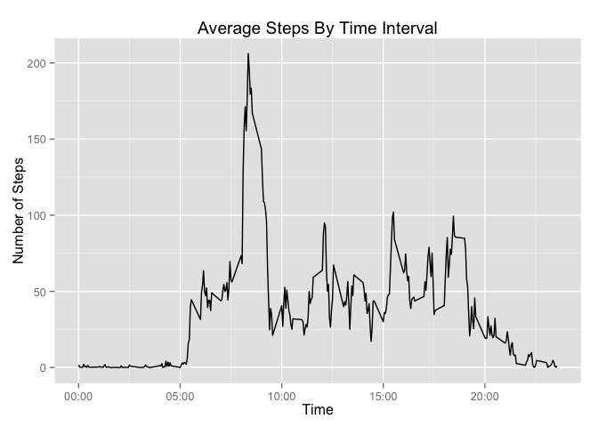

# Reproducible Research: Peer Assessment 1

## Environment


```r
library(dplyr)
```

```
## 
## Attaching package: 'dplyr'
## 
## The following object is masked from 'package:stats':
## 
##     filter
## 
## The following objects are masked from 'package:base':
## 
##     intersect, setdiff, setequal, union
```

```r
library(lubridate)
library(ggplot2)
```

## Loading and preprocessing the data

Read the data.  Dates are often read in as factors unless you read
them as something else, so we specify that it's a character.


```r
setwd("/Users/mgast/Dropbox/data-science-specialization/5-reproducible-research/RepData_PeerAssessment1")
activity <- read.csv("activity.csv",colClasses=c("integer","character","integer"))
activity$interval <- sprintf("%04d",activity$interval)
```

Then, we need to create timestamps.  strptime returns a `POSIXlt` data structure, which can't go into a data frame, so we convert it to a POSIXct with `strftime`.


```r
activity <- mutate(activity,datetime=strftime(strptime(paste(date,interval), format="%Y-%m-%d %H%M")))
activity <- mutate(activity, dayofweek=weekdays(as.Date(activity$date)))
activity$daytype[activity$dayofweek %in% c("Saturday","Sunday")] <- "weekend"
```

## What is mean total number of steps taken per day?

1. Calculate the total number of steps taken per day

We can use the `aggregate` function to do this.  By default, aggregate ignores NA values.


```r
daily.steps <- aggregate(steps ~ date, data=activity,FUN=sum)
head(daily.steps)
```

```
##         date steps
## 1 2012-10-02   126
## 2 2012-10-03 11352
## 3 2012-10-04 12116
## 4 2012-10-05 13294
## 5 2012-10-06 15420
## 6 2012-10-07 11015
```

2.  Make a histogram of the total number of steps taken each day


```r
ggplot(daily.steps,aes(steps)) + geom_histogram()
```

 

3. Calculate and report the mean and median of the total number of steps taken per day


```r
mean(daily.steps$steps)
```

```
## [1] 10766.19
```

```r
median(daily.steps$steps)
```

```
## [1] 10765
```

## What is the average daily activity pattern?

1. Make a time series plot (i.e. type = "l") of the 5-minute interval (x-axis) and the average number of steps taken, averaged across all days (y-axis).

Once again, the `aggregate` function removes NA values by default.

TODO: plot the X-axis in this plot as a timestamp, not a string/integer.


```r
ada <- aggregate(steps ~ interval, data=activity,FUN=mean)
ggplot(ada,aes(x=as.numeric(interval),y=steps)) + geom_line()
```

 

2. Which 5-minute interval, on average across all the days in the dataset, contains the maximum number of steps?


```r
ada[which.max(ada$steps),]
```

```
##     interval    steps
## 104     0835 206.1698
```

## Imputing missing values

1. Calculate and report the total number of missing values in the dataset (i.e. the total number of rows with NAs)


```r
sum(is.na(activity$steps))
```

```
## [1] 2304
```

2.  Devise a strategy for filling in all of the missing values in the dataset. The strategy does not need to be sophisticated. For example, you could use the mean/median for that day, or the mean for that 5-minute interval, etc.

The strategy is to replace an "NA" value with the average over the data set for the 5-minute interval with a missing value.

3.  Create a new dataset that is equal to the original dataset but with the missing data filled in.

TODO - finish this!

4.  Make a histogram of the total number of steps taken each day and Calculate and report the mean and median total number of steps taken per day. Do these values differ from the estimates from the first part of the assignment? What is the impact of imputing missing data on the estimates of the total daily number of steps?

TODO - finish this!

## Are there differences in activity patterns between weekdays and weekends?

1. Create a new factor variable in the dataset with two levels – “weekday” and “weekend” indicating whether a given date is a weekday or weekend day.

The factor was created as part of preprocessing.

2.  Make a panel plot containing a time series plot (i.e. type = "l") of the 5-minute interval (x-axis) and the average number of steps taken, averaged across all weekday days or weekend days (y-axis). See the README file in the GitHub repository to see an example of what this plot should look like using simulated data.

Once again, the aggregate function can be used, but rather than by grouping solely on the interval, we also group on the type of date.


```r
ada2 <- aggregate(steps ~ interval+daytype, data=activity,FUN=mean)
ggplot(ada2,aes(x=as.numeric(interval),y=steps,group=daytype)) + geom_line() + facet_grid(daytype ~ .)
```

 
